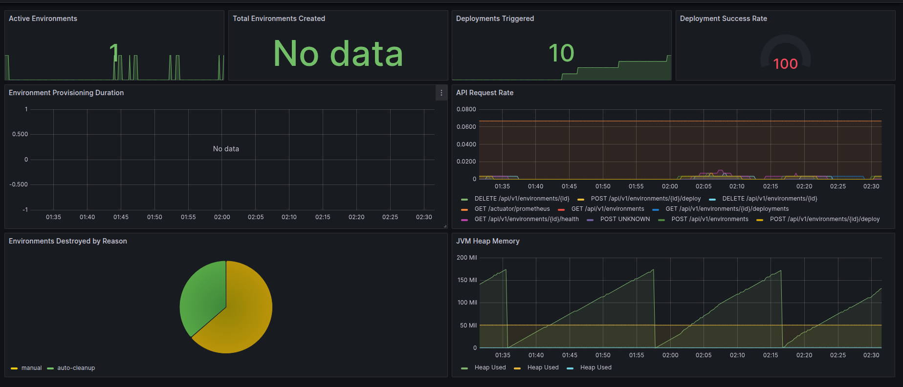
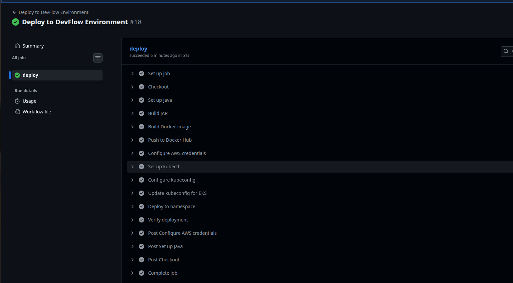
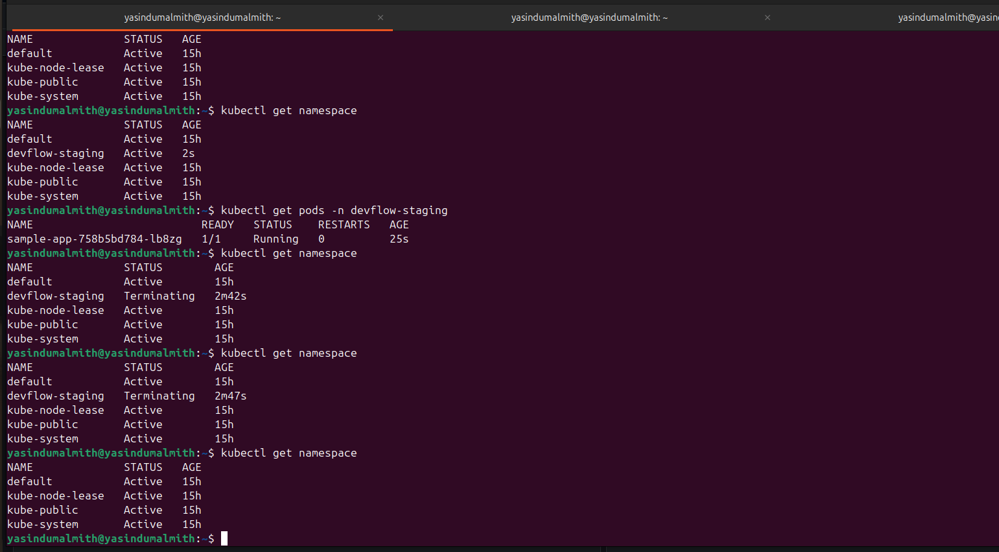

# DevFlow — Internal Developer Self-Service Platform

A platform that lets developers provision isolated Kubernetes environments, deploy services into them, and monitor everything through a REST API — without involving a DevOps engineer.

## The Problem

In early-stage startups, a single DevOps engineer becomes the bottleneck for the entire team. Developers wait hours or days for staging environments, deployment triggers, or environment cleanup. DevFlow removes that bottleneck by giving developers self-service control through an API.

## What It Does

- One API call provisions a real Kubernetes namespace on AWS EKS
- Developers trigger deployments via API — no manual kubectl needed
- Idle environments are automatically destroyed after 30 minutes to control AWS cost
- Every action is logged in an audit trail
- Prometheus and Grafana monitor the platform in real time

## Architecture

```
Developer
    │
    │ REST API
    ▼
Spring Boot (DevFlow Core)
    │
    ├── PostgreSQL (audit logs, environment registry)
    ├── Terraform Runner → AWS EKS namespace provisioning
    ├── GitHub Actions Client → triggers deployment workflows
    ├── Fabric8 Kubernetes Client → reads pod health
    ├── Scheduler (every 5 min) → destroys idle environments
    └── Micrometer + Prometheus → metrics
```

## Tech Stack

| Layer | Technology | Why |
|---|---|---|
| API | Spring Boot 3, Java 17 | Production grade backend |
| Database | PostgreSQL | ACID guarantees for audit log |
| Infrastructure | Terraform | Reproducible, version controlled |
| Orchestration | AWS EKS | Real cloud Kubernetes |
| Pipelines | GitHub Actions | Triggered via REST API |
| Metrics | Prometheus + Grafana | Observability standard |
| Security | Trivy, Checkov | Container and IaC scanning |

## API Reference

| Method | Endpoint | Description |
|---|---|---|
| POST | `/api/v1/environments` | Provision new environment |
| GET | `/api/v1/environments` | List all environments |
| GET | `/api/v1/environments/{id}` | Get environment status |
| DELETE | `/api/v1/environments/{id}` | Destroy environment |
| POST | `/api/v1/environments/{id}/deploy` | Trigger deployment |
| GET | `/api/v1/environments/{id}/health` | Live K8s health metrics |
| GET | `/api/v1/audit-logs` | Full audit trail |

## Key Features

**Self-service provisioning**  
Developers create their own environments via API. Average provisioning time: 9 seconds.

**Cost control through auto-destroy**  
A scheduler runs every 5 minutes, finds environments idle for 30+ minutes, and destroys them via Terraform. In a real startup running 10 environments, this cuts cloud cost by 40-60%.

**Full audit trail**  
Every action — creation, deployment, destruction — written to PostgreSQL with timestamp and actor. Searchable by environment ID.

**Resource isolation**  
Each environment gets its own namespace with resource quotas (CPU, memory, pod count) and network policies preventing cross-environment traffic.

**Observable platform**  
Custom business metrics: active environments, provisioning duration p95, deployment success rate, environments destroyed by reason.

## Running Locally

### Prerequisites
- Java 17, Maven
- Docker
- AWS CLI configured
- eksctl
- An EKS cluster

### Setup

```bash
# Start PostgreSQL
docker run -d --name devflow-db \
  -e POSTGRES_DB=devflow \
  -e POSTGRES_USER=devflow_user \
  -e POSTGRES_PASSWORD=devflow_pass \
  -p 5432:5432 postgres:15

# Start monitoring stack
cd monitoring && docker compose up -d

# Configure kubectl for EKS
aws eks update-kubeconfig --region ap-south-1 --name devflow-cluster

# Run the app
./mvnw spring-boot:run
```

API available at `http://localhost:8080`  
Grafana dashboard at `http://localhost:3000` (admin / devflow123)

## Screenshots

### Grafana Dashboard


### Successful GitHub Actions Deployment


### Live Environment in EKS


## Future Improvements

- JWT-based authentication and team-level RBAC
- Multi-cluster support across regions
- SLO/SLI definitions with error budget alerting
- Webhook-based pipeline status (replacing polling)
- Per-environment cost reporting in dollars

## What I Learned Building This

- Async patterns in Spring Boot for long-running infrastructure operations
- Production patterns: audit logging, resource quotas, network policies
- Cost-aware engineering through automated cleanup
- Custom Micrometer metrics for domain events
- AWS EKS networking, IAM, and Terraform integration
